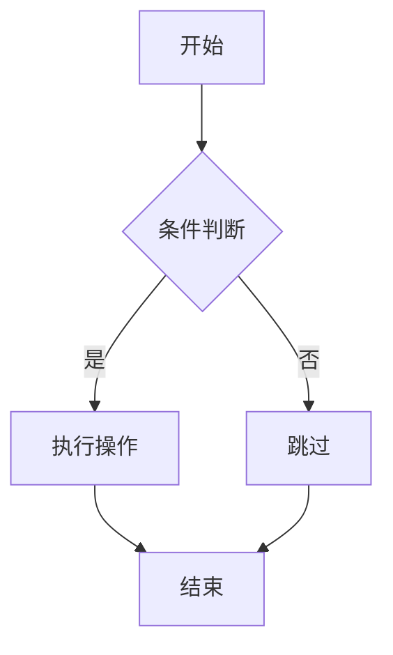

# Markdown Pro - 使用指南

## 启动开发服务器

```bash
cd /home/ldcyes/Projects/markdown-pro
npm run dev
```

然后在浏览器中打开 `http://localhost:5173`

## 已实现功能

### 1. 基础编辑
- ✅ 实时 WYSIWYG 编辑
- ✅ 粗体、斜体、标题（H1-H3）
- ✅ 无序列表
- ✅ 代码块

### 2. 表格功能
- ✅ 插入 3x3 表格
- ✅ 添加/删除行、列
- ✅ 单元格对齐

### 3. 图片功能
- ✅ 工具栏插入图片
- ✅ 拖拽图片到编辑器
- ✅ 粘贴剪贴板图片
- ✅ 图片裁剪（可选）
- ✅ 设置 Alt 文本

### 4. LaTeX 公式
- ✅ 行内公式：`$E = mc^2$`
- ✅ 块级公式：
  ```
  $$E = mc^2$$
  ```
- ✅ Markdown 互转

### 5. Mermaid 图表
- ✅ 流程图、时序图等
  ```
  ```mermaid
  graph TD
  A-->B
  ```
  ```
- ✅ Markdown 互转

### 6. 文件操作
- ✅ 打开 .md 文件
- ✅ 保存为 .md 文件
- ✅ 自动保存到 LocalStorage

### 7. 其他
- ✅ 大纲视图（侧边栏）
- ✅ 深色/浅色主题

## 测试示例

### LaTeX 公式
```
行内公式：The energy-mass equation is $E = mc^2$.

块级公式：
$$
\int_0^\infty e^{-x^2} dx = \frac{\sqrt{\pi}}{2}
$$

复杂公式：
$$
\sum_{i=1}^{n} i = \frac{n(n+1)}{2}
$$
```

### Mermaid 图表
````markdown

````

### 表格
```
| 列1 | 列2 | 列3 |
|-----|-----|-----|
| A   | B   | C   |
| D   | E   | F   |
```

### 图片
```

```

## 注意事项

1. **LaTeX 和 Mermaid 渲染**：当前显示为原始语法，可视化渲染需要进一步集成
2. **图片存储**：Base64 编码存储在 Markdown 中，大图片会增加文件大小
3. **浏览器兼容**：建议使用 Chrome/Edge/Firefox 最新版本

## 开发状态

- ✅ 核心编辑器完成
- ✅ 表格功能完成
- ✅ 图片功能完成
- ✅ LaTeX 解析完成（渲染组件已创建）
- ✅ Mermaid 解析完成（渲染组件已创建）
- ⏳ 可视化渲染集成（待完成）
- ⏳ 多格式导出（待开发）
- ⏳ 插件系统（待开发）
